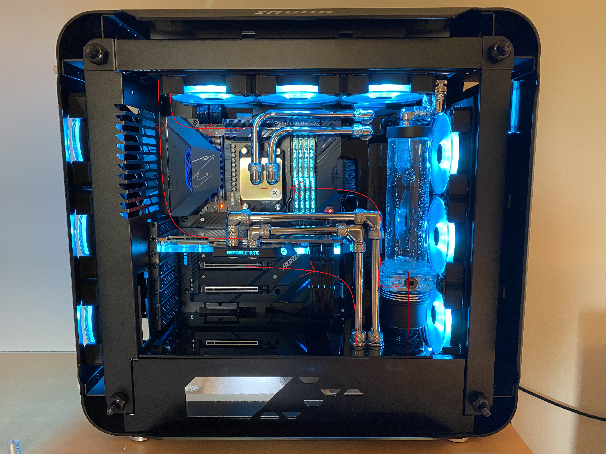
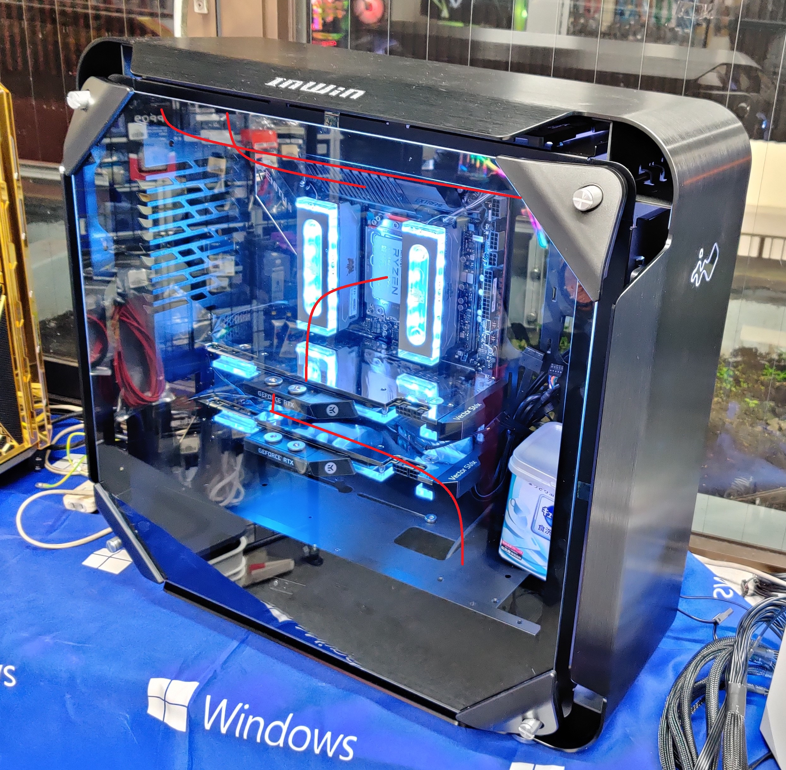
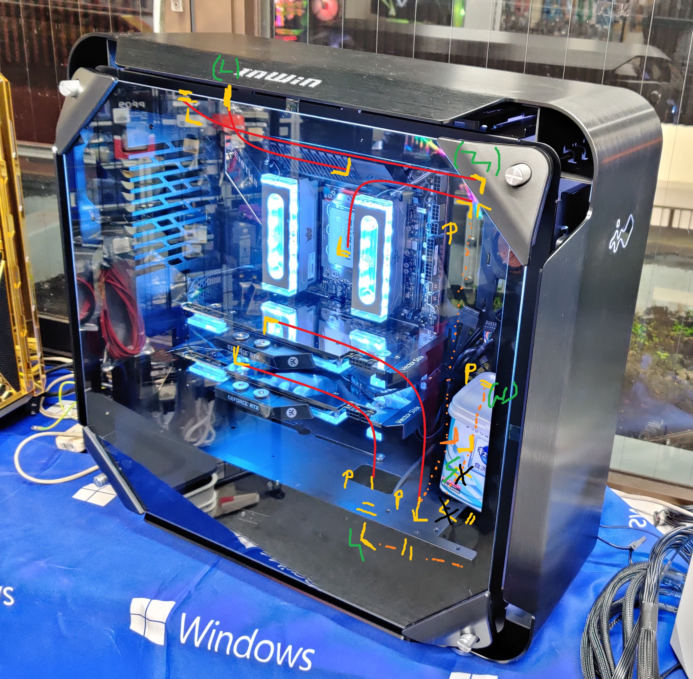

**IDEA 1** ( Reservoir - CPU - Top Rad - GPU - Drain - Front Rad - Reservoir)
=============================================================================

Detail path
-------

- Reservoir (out)
    - 90 deg fitting
    - *90 deg bend*
    - 90 deg fitting
    - Spacer ( ? mm )
- CPU (bottom)
- CPU (top)
    - Spacer ( ? mm )
    - 90 deg fitting
    - *90 deg bend*
    - Straight fitting
- Top Rad (back)
- Top Rad (front)
    - Straight fitting
    - *90 deg bend*
    - --- *alignment?* --- 
    - 90 deg fitting
- GPU (top left)
- GPU (bottom right)
    - 90 deg fitting
    - *90 deg bend*
    - Pass-through fitting
- Bottom case
    - *90 deg bend* or 90 deg link
    - T spliter
    - --- aligment? ---
    - Straight fitting
- Front Rad (front)
- Front Rad (back)
    - Straight fitting
    - 90 deg link ?
    - 90 deg link ?
    - 90 deg link ?
    - Straight fitting ?
- Reservoir (in)

**IDEA 2** ( Reservoir - Front Rad - Drain - GPU - CPU - Top Rad - Reservoir)
=============================================================================

Detail path
-------

**IDEA 3** ( Reservoir - Front Rad - Drain - GPU - (Back) - CPU - Top Rad - Reservoir)
=============================================================================

Detail path
-------

